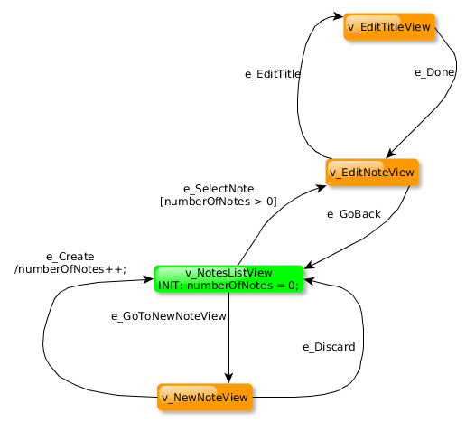

# A simple example using GraphWalker together with an Appium.

[Appium](http://appium.io/) is a driver to interact with mobile app.


## The test



The system under test is a simple android app called Notepad. It's packaged with the test under:

```
src/main/resources/Notepad.apk
```

The test will install the Notepad app to the target device, and start running the test.
The model to the right depicts the design of the test. The code that implements the test is:

```
src/main/java/org/graphwalker/appium/NotesListTest.java
```

The `class NotesListTest` implements the `interface NotesList'. That interface is automatically generated by GraphWalker,
either by running one of the following commands:

```
mvn graphwalker:generate-sources
mvn graphwalker:test
```

Worth noting in the code is the line with GraphWalker annotation:

```java
@GraphWalker(value = "random(edge_coverage(100))", start = "v_NotesListView")
```

It does 2 things:

1.  `value = "random(edge_coverage(100))"`<br>
It sets the generator and the stop condition of the of the path generation of the test. `random(edge_coverage(100))` means
the the path generator is the random path generator, and the stop condition is when all edges of the graph has been visited.
2. `start = "v_NotesListView"`
Tells GraphWalker where to start the execution. `v_NotesListView` will be the first graph element to be executed.

The above is the equivalent as running the test offline:

```
java -jar graphwalker-cli-3.4.0.jar offline -m NotesList.graphml "random(edge_coverage(100))"
```

## Steps to execute the project

1. Install appium. On Ubuntu:

```
sudo apt install nodejs-legacy
sudo npm install -g appium
```

2. Start android emulator.<br>
The test is only verified running the Android emulator using Nexus 7, 2012 with API 19.
3. Start appium
4. To run the test:

```
git clone https://github.com/GraphWalker/graphwalker-example.git
cd graphwalker-example/java-appium
mvn graphwalker:test
```

The maven plugin `graphwalker:test`