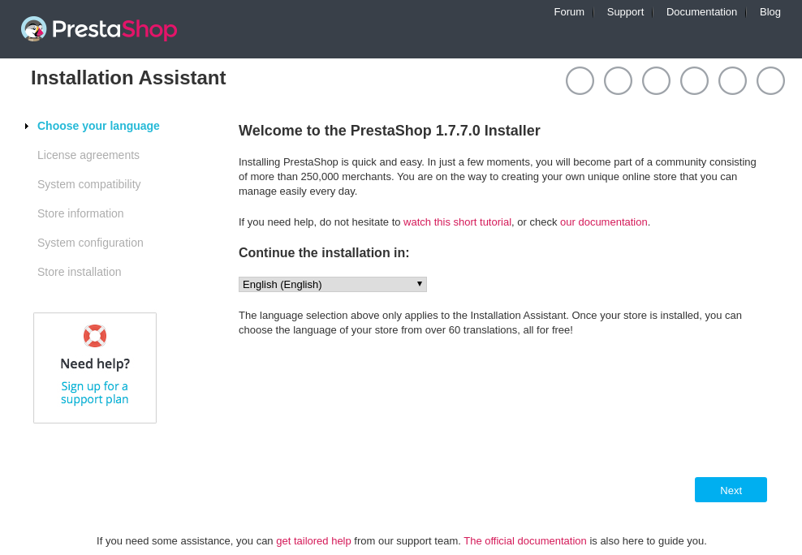
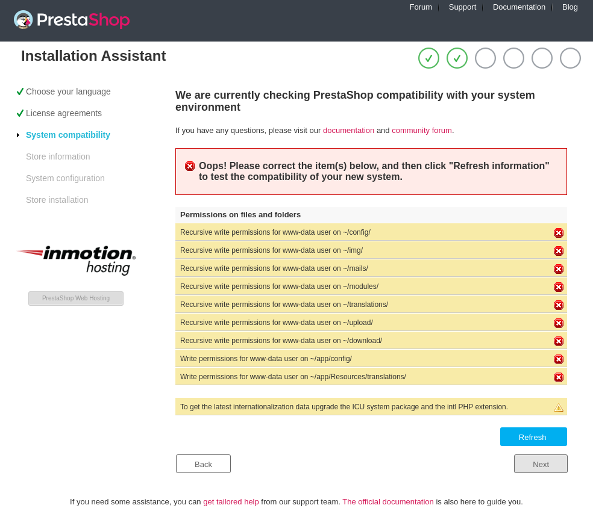
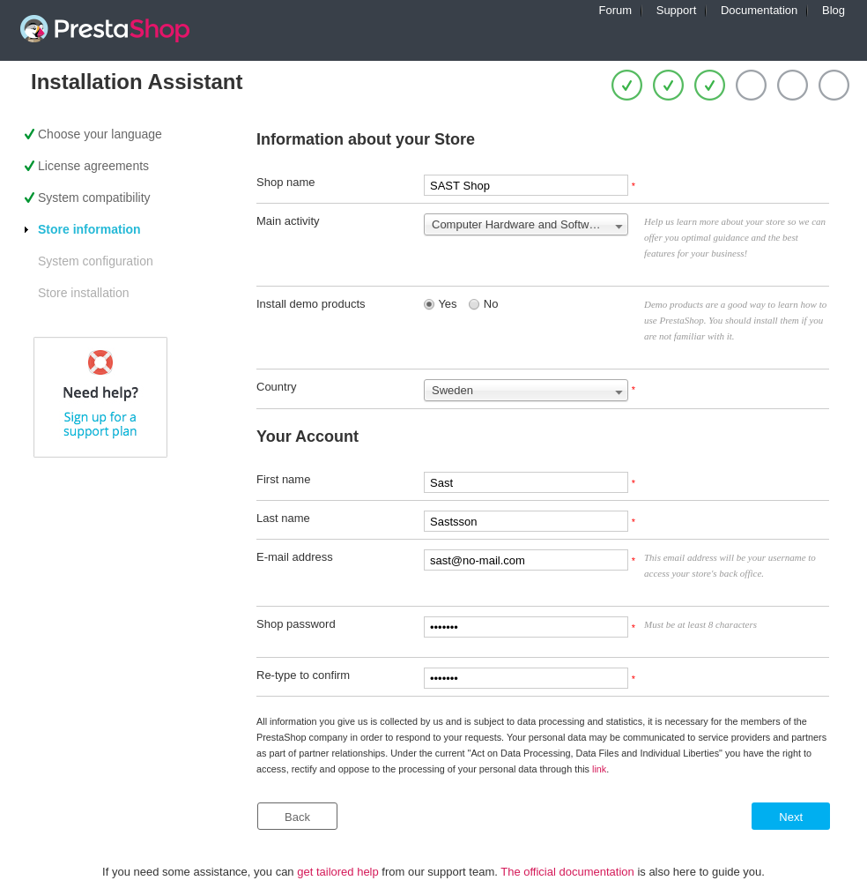
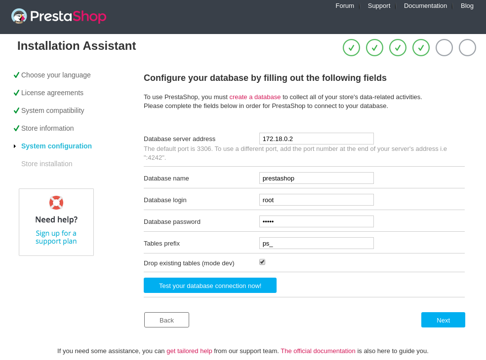

# This project was made for a presentation at  [SAST](http://sast.se/meeting.jsp?id=381)

The example uses [PrestaSop](https://www.prestashop.com/en) as the System Under Test [SUT].
To get the the SUT installed locally the presentation uses the docker version of PrestaShop. Go to [PrestaShops GitHub
page](https://github.com/PrestaShop/PrestaShop) and follow the instructions there.  

Before running the example, make sure following requirements are met/installed on your machine:
* Java JDK >= 8
* Maven >= 3.5
* Docker >= 18 
* Firefox latest version

## Get the PrestaShop demo running
 
```shell script
git clone https://github.com/PrestaShop/PrestaShop
cd PrestaShop
docker-compose up
```

If you encounter any problems with the `docker` command, please google your problems. This example will ot provide any help.

When `docker-compse up` is done (it will take some time the first time it's run), PrestaShop needs to be configured.
 * Goto http://localhost:8001
 * Follow the instructions given by the *PrestaShop Installation Assistant*.<br>
   Use English as installation language.



* If you encounter `Permissions on files and folders`:



Fix that by logging into the PrestaShop webserver :

```shell script
$ docker ps
CONTAINER ID        IMAGE                         COMMAND                  CREATED             STATUS              PORTS                                NAMES
fa9415b6462d        prestashop/prestashop-git:7   "docker-php-entrypoi…"   18 minutes ago      Up 18 minutes       0.0.0.0:8001->80/tcp                 prestashop-git
50af85c52263        mysql:5                       "docker-entrypoint.s…"   18 minutes ago      Up 18 minutes       33060/tcp, 0.0.0.0:32768->3306/tcp   prestashop_mysql_1

# Enter the webserver using its id 
$ docker exec -it fa9415b6462d bash
root@fa9415b6462d:/var/www/html# 

# Fix permissions for the web server
root@fa9415b6462d:/var/www/html# chown -R www-data:www-data *
root@fa9415b6462d:/var/www/html#  exit
```

Go back to the *Installation Assistant* and click on the **Refresh** button.

Them, add Store Information.


To connect to the PrestaShop mysql database, you need to find out the IP-addres of it first:

```shell script
$ docker inspect 50af85c52263 | grep -oP  '"IPAddress": "[0-9]+\.[0-9]+\.[0-9]+\.[0-9]+"'
"IPAddress": "172.18.0.2"
```

The password for the database if found in the `cat docker-compose.yml` file. When this was written, it was `password`.


When done, goto http://localhost:8001


## Run the GraphWalker test

```shell script
git clone https://github.com/GraphWalker/graphwalker-example.git
cd graphwalker-example/java-prestashop
mvn compile exec:java -Dexec.mainClass="com.prestashop.runners.Runner"
```
